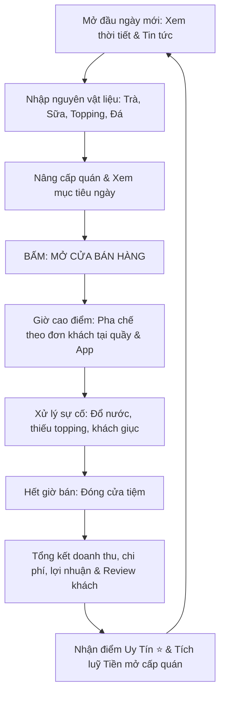

# 🧋 KẾ HOẠCH PHÁT TRIỂN WEB GAME: TIỆM TRÀ SỮA ONLINE (BOBA SHOP SIMULATOR)

> **Mô hình tham chiếu:** Game mô phỏng kinh doanh tương tự *Tiệm Mì Cay* ([aenhatrang.com](https://aenhatrang.com/)), chuyển thể toàn bộ bối cảnh và cơ chế sang **Tiệm Trà Sữa**.  
> **Đặc tả kỹ thuật:** Hoạt động độc lập trên Client-side (HTML5/CSS3/Vanilla JS), lưu dữ liệu qua `localStorage` (không cần Database & phân quyền người dùng ở giai đoạn này), hỗ trợ **Responsive toàn diện** (Mobile, Tablet, Desktop).

---

## 📑 MỤC LỤC
1. [Tầm nhìn & Định vị sản phẩm](#1-tầm-nhìn--định-vị-sản-phẩm)
2. [Bảng quy đổi cơ chế (Tiệm Mì Cay ➔ Tiệm Trà Sữa)](#2-bảng-quy-đổi-cơ-chế)
3. [Vòng lặp trò chơi cốt lõi (Core Game Loop)](#3-vòng-lặp-trò-chơi-cốt-lõi)
4. [Hệ thống Gameplay chi tiết](#4-hệ-thống-gameplay-chi-tiết)
   - 4.1. [Cơ chế pha chế tại quầy (Pha trà - Chọn đường/đá - Thêm Topping)](#41-cơ-chế-pha-chế-tại-quầy)
   - 4.2. [Cơ chế khách hàng & Đơn hàng online](#42-cơ-chế-khách-hàng--đơn-hàng-online)
   - 4.3. [Hệ thống kho hàng, hạn sử dụng & Thất thoát](#43-hệ-thống-kho-hàng-hạn-sử-dụng--thất-thoát)
   - 4.4. [Hệ thống nâng cấp & Thuê nhân viên](#44-hệ-thống-nâng-cấp--thuê-nhân-viên)
   - 4.5. [Sổ sách tài chính & Đánh giá của khách hàng (Reviews)](#45-sổ-sách-tài-chính--đánh-giá-của-khách-hàng)
   - 4.6. [Sự kiện ngẫu nhiên & Mini-game phụ](#46-sự-kiện-ngẫu-nhiên--mini-game-phụ)
5. [Kiến trúc kỹ thuật & Cấu trúc dữ liệu (Client-Only)](#5-kiến-trúc-kỹ-thuật--cấu-trúc-dữ-liệu)
   - 5.1. [Tech Stack](#51-tech-stack)
   - 5.2. [Cấu trúc mã nguồn đề xuất](#52-cấu-trúc-mã-nguồn-đề-xuất)
   - 5.3. [Cấu trúc dữ liệu LocalStorage (Data Schema)](#53-cấu-trúc-dữ-liệu-localstorage)
6. [Thiết kế giao diện (UI/UX) & Chiến lược Responsive](#6-thiết-kế-giao-diện-uiux--chiến-lược-responsive)
   - 6.1. [Hệ thống màu sắc & Font chữ](#61-hệ-thống-màu-sắc--font-chữ)
   - 6.2. [Bố cục Responsive trên Mobile vs Desktop](#62-bố-cục-responsive-trên-mobile-vs-desktop)
   - 6.3. [Wireframe mô phỏng các màn hình chính](#63-wireframe-mô-phỏng-các-màn-hình-chính)
7. [Kế hoạch triển khai theo từng giai đoạn (Roadmap)](#7-kế-hoạch-triển-khai-theo-từng-giai-đoạn)

---

## 1. TẦM NHÌN & ĐỊNH VỊ SẢN PHẨM
- **Tên dự án dự kiến:** **Tiệm Trà Sữa Nhỏ** (hoặc *Góc Trà Sữa Cute / Boba Story*).
- **Thể loại:** Casual Cooking Time-Management / Business Tycoon mô phỏng quán ăn đường phố phong cách Việt Nam.
- **Phong cách thị giác (Art Style):** Pastel ấm cúng, hoạt hình dễ thương (Cozy/Chibi), các animation rung lắc, giọt nước rơi, khói đá, nụ cười khách hàng tạo cảm giác gây nghiện và thư giãn.
- **Đối tượng người chơi:** Người thích game nấu ăn thư giãn trên điện thoại, học sinh, sinh viên, dân văn phòng chơi nhanh trong 5-10 phút rảnh rỗi mà không cần cài đặt ứng dụng.

---

## 2. BẢNG QUY ĐỔI CƠ CHẾ

| Tiệm Mì Cay (`aenhatrang.com`) | Tiệm Trà Sữa (Dự án mới) | Mô tả chi tiết chuyển đổi |
| :--- | :--- | :--- |
| **Nồi nấu nước lẩu (Xương, Tomyum, Kimchi...)** | **Bình ủ cốt trà (Hồng trà, Trà xanh/Lài, Ô long, Matcha, Trà sữa Thái)** | Người chơi phải rót đúng loại cốt trà theo yêu cầu của khách vào cốc/bình shaker. |
| **Vợt trụng mì (Canh thời gian sống/chín/nhũn)** | **Máy lắc Shaker / Máy đánh kem (Canh thời gian lắc đều ly trà)** | Bấm bắt đầu lắc, thanh đo chạy từ "Chưa tan" ➔ "Hoàn hảo" (xanh lá) ➔ "Tan đá/nhạt trà" (đỏ). |
| **Cấp độ cay (Cấp 0 đến Cấp 7)** | **Mức Đường & Mức Đá (0%, 30%, 50%, 70%, 100%)** | Thay vì thêm ớt cay, khách sẽ chọn tỉ lệ đường & đá riêng biệt (VD: *Hồng trà sữa 50% đường, 70% đá*). |
| **Khay Topping tô mì (Tôm, Bò, Mực, Nấm, Xúc xích...)** | **Khay Topping trà sữa (Trân châu đen, Thạch phô mai, Pudding trứng, Thạch đào, Kem Cheese...)** | Nhấp chọn các loại topping cho vào ly. Mỗi loại topping có giá cost và lượng tồn kho riêng. |
| **Đóng tô mì hoàn chỉnh (Tô sứ)** | **Máy dập màng nắp ly / Cắm ống hút** | Sau khi đủ trà, đường, đá, topping ➔ Bấm nút dập nắp ly tạo hiệu ứng "Tách!" vui tai. |
| **Đơn online (ShopeeFood, GrabFood màu xanh/cam)** | **Đơn giao tận nơi (Now, Beamin, GrabFood, TikTok)** | Đơn hẹn giờ từ shipper, cần chuẩn bị kịp thời gian trước khi shipper đến lấy hàng. |
| **Vũng nước bẩn trên sàn (Chạm 3 lần để lau)** | **Trân châu rơi / Nước trà tràn quầy bar** | Xuất hiện ngẫu nhiên khi khách đông, chạm nhanh để dọn kẻo bị trừ điểm vệ sinh an toàn. |
| **Mời trà đá / Nước lọc giải cay** | **Tặng bánh gấu / Kẹo que / Khăn lạnh** | Khi khách sốt ruột (thanh kiên nhẫn sắp cạn), bấm tặng để làm dịu khách chờ thêm. |
| **Nhân viên phụ bếp (Cô Chôm, Bé Ớt...)** | **Nhân viên quầy bar (Pha chế phụ, Thu ngân, Shipper ruột)** | Tự động hóa các thao tác lặp lại (tự múc đá, tự dập nắp, tự gom tiền). |

---

## 3. VÒNG LẶP TRÒ CHƠI CỐT LÕI (CORE GAME LOOP)



Mỗi ngày trong game kéo dài từ **60 đến 120 giây** (tùy cấp quán), tạo nhịp độ dồn dập, thử thách phản xạ và khả năng sắp xếp công việc của người chơi.

---

## 4. HỆ THỐNG GAMEPLAY CHI TIẾT

### 4.1. Cơ chế pha chế tại quầy
Một ly trà sữa tiêu chuẩn bao gồm các bước sau:
1. **Lấy ly:** Chọn kích cỡ ly (Size M hoặc Size L - mở khóa ở level cao).
2. **Chọn cốt trà:** 
   - *Hồng trà truyền thống* (màu nâu đỏ)
   - *Trà Ô long rang* (màu hổ phách)
   - *Lục trà lài* (màu vàng sáng)
   - *Matcha Nhật* (màu xanh lá)
3. **Thêm sữa & Đường đá:**
   - Bình sữa tươi / bột sữa (nhấp 1 lần).
   - Nút chọn mức đường: `0%` | `30%` | `50%` | `70%` | `100%`.
   - Nút chọn mức đá: `Nóng` | `Không đá` | `50% đá` | `100% đá`.
4. **Lắc Shaker (Mini-timing gauge):**
   - Giữ nút hoặc canh kim dao động vào ô màu xanh lá (Perfect shake) để nhận thêm tiền tip `+20%`.
5. **Thêm Topping:**
   - Bảng 6 - 12 khay topping (mở khóa dần). Người chơi nhấp chọn đúng topping khách yêu cầu.
   - Nếu bấm nhầm topping: có thể bấm **Đổ thùng rác** (mất ly, lỗ vốn nguyên liệu) hoặc bấm dập nắp giao liều (khách trừ sao, đánh giá 1 sao).
6. **Dập nắp ly & Giao món (Serve):**
   - Bấm nút **GIAO MÓN** để đẩy ly sang cho khách tương ứng.

### 4.2. Cơ chế khách hàng & Đơn hàng online
- **Hàng đợi tại quán:** Tối đa 3 khách đứng chờ đồng thời (có thể nâng cấp lên 4-5 ghế).
- **Thanh kiên nhẫn (Patience Meter):**
   - Vòng tròn quanh avatar khách rút dần theo thời gian.
   - Trạng thái: Bình tĩnh (Xanh lá) ➔ Sốt ruột (Vàng - toát mồ hôi) ➔ Tức giận (Đỏ - rung lắc) ➔ Bỏ về (Khách bực bội, trừ 1 sao danh tiếng).
- **Các nhóm khách đặc biệt:**
   - *Học sinh/Sinh viên:* Đi theo nhóm, gọi nhiều ly một lúc, ít kiên nhẫn nhưng mua nhiều.
   - *Cô văn phòng:* Khó tính, hay yêu cầu "ít đường 30%, nhiều đá, ít trân châu".
   - *Food Reviewer / Tiktoker:* Nếu phục vụ điểm tuyệt đối sẽ được đăng bài khen, hôm sau khách tăng gấp đôi; nếu phục vụ hỏng sẽ bị bóc phốt.
- **Đơn hàng App (ShopeeFood / Grab):**
   - Hiển thị ở khay đơn góc trên. Có đồng hồ đếm ngược của Shipper (VD: 30s nữa tới lấy).
   - Đơn app thường là đơn số lượng lớn (2 - 4 ly).

### 4.3. Hệ thống kho hàng, hạn sử dụng & Thất thoát
- Nguyên liệu mua vào đầu ngày với giá bán buôn:
  - *Lá trà / Túi lọc* (Hạn dài: 7 ngày)
  - *Sữa chua / Sữa tươi* (Hạn ngắn: 2-3 ngày, để quá ngày sẽ bị chua hỏng)
  - *Trân châu đã luộc* (Chỉ dùng được trong ngày, cuối ngày không bán hết phải đổ bỏ)
- **Hết hàng giữa giờ bán (Out of Stock):**
  - Nếu hết trân châu đen giữa giờ, khách gọi món đó sẽ hiện chữ gạch ngang đỏ: ~~Trân châu đen~~ **Hết**.
  - Người chơi có thể trả phí cao gấp đôi để **"Mua gấp từ tiệm tạp hóa kế bên"** (tốn 5 giây chờ ship).

### 4.4. Hệ thống nâng cấp & Thuê nhân viên
Tiền kiếm được từ các ngày bán sẽ dùng để tái đầu tư trong tab **Nâng Cấp**:
- **Cơ sở vật chất:**
  - *Máy dập nắp tự động:* Tự dập màng khi đủ nguyên liệu, tiết kiệm 1 thao tác click.
  - *Bình giữ nhiệt ủ trà to hơn:* Nấu sẵn được nhiều cốt trà, không lo cạn bình.
  - *Quạt máy / Điều hòa quán:* Làm mát quán, giúp thanh kiên nhẫn của khách tụt chậm hơn 25%.
  - *Loa phát nhạc Lofi:* Khách vui vẻ hơn, tăng tỉ lệ cho tiền Tip.
- **Thuê nhân viên tự động:**
  - *Bé phụ bếp:* Tự động múc đá và múc trân châu đen.
  - *Anh Shipper ruột:* Đơn app tự động được ưu tiên giao nhanh, không bao giờ trễ giờ.
  - *Mèo thần tài:* Tăng 10% doanh thu mỗi ngày.

### 4.5. Sổ sách tài chính & Đánh giá của khách hàng
- **Báo cáo cuối ngày (Daily Ledger):**
  - Doanh thu bán tại quầy + Doanh thu bán online.
  - Trừ đi: Tiền vốn nguyên liệu đã dùng + Tiền nguyên liệu hư hỏng vứt đi + Tiền thuê mặt bằng theo ngày.
  - `= LỢI NHUẬN RÒNG`.
- **Hệ thống Reviews (Đánh giá Google Maps / Foody quán):**
  - Khách để lại bình luận thật (khoảng 30-50 mẫu câu ngẫu nhiên sinh động):
    - *5 sao:* "Trà sữa đậm vị trà béo vị sữa, trân châu mềm dẻo 10 điểm!", "Quán có con mèo cưng xỉu".
    - *1 sao:* "Bảo 30% đường mà ngọt khè như chè đậu đen", "Chờ 20 phút không thấy nước đâu, cạch mặt!".
  - **Mini-chat phản hồi review:** Người chơi có thể chọn câu trả lời xin lỗi hoặc tặng voucher để gỡ gạc điểm uy tín quán.

### 4.6. Sự kiện ngẫu nhiên & Mini-game phụ
- **Thời tiết:**
  - *Trời mưa dầm:* Khách tại quán vắng, đơn app nổ liên tục.
  - *Trời nắng nóng gay gắt:* Khách gọi nhiều đá, nhu cầu trà trái cây / trà tắc tăng đột biến.
- **Biến động thị trường:** Giá sữa tăng 20%, hoặc hôm nay có lễ hội gần trường học lượng khách x2.
- **Mini-game buổi tối:**
  - *Nấu mẻ trân châu mới:* Canh lửa đảo trân châu cho ngấm đường đen.
  - *Rửa ly / Lau dọn:* Vuốt màn hình để lau sạch bề mặt quầy trước khi đóng cửa.

---

## 5. KIẾN TRÚC KỸ THUẬT & CẤU TRÚC DỮ LIỆU

### 5.1. Tech Stack
- **Ngôn ngữ:** HTML5, CSS3, Vanilla JavaScript (ES6+ Module hoặc IIFE sạch sẽ, không phụ thuộc nặng nề vào build tool phức tạp).
- **Lưu trữ dữ liệu:** `Window.localStorage` với cơ chế Auto-save sau mỗi ngày và chức năng Export/Import mã lưu game (Transfer code) để người chơi chuyển thiết bị.
- **Hiệu ứng đồ họa:** CSS Keyframes, SVG inline kết hợp Canvas 2D cho hạt hiệu ứng (Confetti, tiền xu bay, giọt nước đá rơi).
- **Âm thanh:** Web Audio API (tổng hợp hiệu ứng âm thanh sound effect vui tai: tiếng rót nước, tiếng dập nắp "cách", tiếng rung lắc, tiếng "ting ting" nhận tiền).

### 5.2. Cấu trúc mã nguồn đề xuất

```
milktea/
├── index.html              # File HTML chính chứa toàn bộ bố cục Responsive
├── assets/
│   ├── css/
│   │   ├── main.css        # Biến màu, CSS Reset, kiểu chữ
│   │   ├── layout.css      # Hệ thống lưới, Flexbox, khung giả lập điện thoại & desktop
│   │   ├── kitchen.css     # Giao diện quầy pha chế, bình trà, khay topping
│   │   ├── street.css      # Phố xá, hàng đợi khách, biểu cảm khuôn mặt
│   │   └── animations.css  # Các animation lắc, sôi, giọt nước rơi, tiền bay
│   ├── js/
│   │   ├── data/
│   │   │   ├── recipes.js    # Danh mục công thức đồ uống & topping
│   │   │   ├── upgrades.js   # Danh mục nâng cấp & nhân viên
│   │   │   └── reviews.js    # Danh sách bình luận & mẫu câu của khách
│   │   ├── engine/
│   │   │   ├── state.js      # Quản lý State toàn cục & LocalStorage
│   │   │   ├── audio.js      # Bộ phát âm thanh Web Audio
│   │   │   └── timer.js      # Đồng hồ đếm thời gian ca bán
│   │   └── game.js           # File khởi chạy logic chính của trò chơi
│   └── icons/                # Các file icon SVG (bình trà, cốc, topping, mèo, sao)
└── KE_HOACH_TIEM_TRA_SUA.md  # Tài liệu kế hoạch này
```

### 5.3. Cấu trúc dữ liệu LocalStorage

```json
{
  "shopName": "Tiệm Trà Sữa Mộng Mơ",
  "day": 5,
  "money": 1250000,
  "reputationStars": 4.8,
  "level": 3,
  "inventory": {
    "blackTea": 45,
    "greenTea": 20,
    "oolongTea": 15,
    "milk": 50,
    "tapiocaPearl": 80,
    "cheeseFoam": 10,
    "pudding": 15
  },
  "upgrades": {
    "autoSealer": true,
    "fasterIce": 1,
    "tablesCount": 3,
    "hiredHelper": false
  },
  "stats": {
    "totalCupsServed": 142,
    "totalRevenue": 4850000,
    "ratingCount": 28
  },
  "soundEnabled": true
}
```

---

## 6. THIẾT KẾ GIAO DIỆN (UI/UX) & CHIẾN LƯỢC RESPONSIVE

### 6.1. Hệ thống màu sắc & Font chữ
- **Palette màu Trà Sữa ấm cúng:**
  - `Trà sữa truyền thống (Chủ đạo):` `#B38059` / `#8F5D38`
  - `Màu nền tiệm (Kem sữa ngọt ngào):` `#FFF7EE` / `#FAF0E6`
  - `Màu đường đen trân châu:` `#3D261D`
  - `Màu điểm nhấn (Hồng dâu/Trái cây):` `#FF6B8B` / `#FA4D56`
  - `Màu thông báo thành công:` `#48BB78` (Xanh lá trà)
  - `Màu cảnh báo / Nổi bật:` `#F6AD55` (Vàng lòng đỏ trứng)
- **Font chữ khuyến nghị:**
  - Tiêu đề & Nút bấm: `'Paytone One'` hoặc `'Baloo 2'` (Tròn trịa, năng động, đậm chất game).
  - Nội dung mô tả & số liệu: `'Mali'` hoặc `'Be Vietnam Pro'` (Nét vẽ tay dễ thương, hỗ trợ tiếng Việt mượt mà).

### 6.2. Bố cục Responsive trên Mobile vs Desktop

```
+-------------------------------------------------------+
|  MÀN HÌNH DI ĐỘNG (< 600px)                           |
|  - Container tối đa 460px, canh giữa màn hình.        |
|  - Tỉ lệ dọc 9:16 hoặc 100% viewport trên iPhone.     |
|                                                       |
|  [ HEADER: Ngày X | Tiền: 250k | Sao: 4.9⭐ ]         |
|  ---------------------------------------------------  |
|  [ KHU PHỐ / HÀNG ĐỢI KHÁCH HÀNG & BONG BÓNG GỌI MÓN ] |
|  ---------------------------------------------------  |
|  [ QUẦY PHA CHẾ: Bình trà | Đường | Đá | Topping ]    |
|  ---------------------------------------------------  |
|  [ DẬP NẮP / GIAO MÓN ] [ THÙNG RÁC ]                 |
+-------------------------------------------------------+
```

```
+---------------------------------------------------------------------------------+
|  MÀN HÌNH DESKTOP / IPAD XOAY NGANG (>= 600px)                                  |
|  - Chia bố cục 2 cột cân đối, rộng tối đa 1080px:                               |
|                                                                                 |
|  [ HEADER TOÀN CHIỀU RỘNG: Tên quán | Ngày X | Ngân quỹ | Đánh giá sao ]       |
|  -----------------------------------------------------------------------------  |
|  CỘT TRÁI (45%):                             | CỘT PHẢI (55%):                  |
|  - Mặt tiền tiệm trà sữa & Biển hiệu         | - Bàn pha chế chính              |
|  - Dãy khách xếp hàng & Bong bóng gọi món    | - Hàng bình trà ủ sẵn            |
|  - Đơn hàng App shipper đang đến             | - Bảng chọn % Đường & % Đá       |
|  - Khu bàn ghế khách ngồi uống               | - Khay 12 loại Topping sắc màu   |
|                                              | - Máy dập ly & Nút Giao Món      |
+---------------------------------------------------------------------------------+
```

### 6.3. Wireframe mô phỏng các màn hình chính

#### Màn hình Chuẩn Bị (Giai đoạn đầu ngày)
1. **Biển hiệu quán:** Tên quán, Cấp độ quán hiện tại, Thanh EXP mở cấp tiếp theo.
2. **Thanh Tab quản lý:**
   - `Tab 1: Nhập Hàng` (Danh sách trà, sữa, topping, đá kèm nút `+` `-` và tổng tiền dự toán).
   - `Tab 2: Nâng Cấp` (Danh sách máy móc, đồ trang trí, nhân viên có thể mở khóa).
   - `Tab 3: Sổ Sách & Đánh Giá` (Xem biểu đồ tuần, lịch sử lời lỗ, danh sách review của khách).
3. **Nút "MỞ CỬA BÁN NGAY":** Nút to nổi bật dính ở chân màn hình, có âm thanh leng keng của chuông mở cửa khi bấm.

#### Màn hình Bán Hàng (Giai đoạn pha chế)
1. **Dãy khách phố:** 3 chỗ đứng. Mỗi khách có thanh đo sự hài lòng màu xanh bo tròn theo khuôn mặt.
2. **Khung gọi món (Order Bubble):** Khách nói rõ: "Cho 1 Hồng Trà Sữa (L) - 50% Đường, 100% Đá + Trân Châu Đen + Pudding".
3. **Mặt bàn quầy Bar (Kitchen Table):**
   - **Hàng 1:** 4 Bình đựng cốt trà có vòi rót (ấn rót vào ly trung tâm).
   - **Hàng 2:** Bộ chọn Đường (0-30-50-70-100) và Đá (Nóng-0-50-100).
   - **Hàng 3:** Ly trà ở giữa hiển thị trực quan mực nước màu trà dâng lên kèm các viên đá nổi.
   - **Hàng 4:** Khay Topping dạng lưới nút bấm. Bấm đến đâu topping rơi vào ly đến đó.
   - **Hàng 5:** Nút **Dập Ly & Giao Món** (Màu xanh lá rực rỡ) và Nút **Hủy Ly Bỏ Thùng Rác** (Màu xám/đỏ).

#### Màn hình Kết Ca (Tổng kết ngày)
- Bảng hóa đơn in chi tiết:
  - Doanh thu: `+ 850.000đ`
  - Tiền hàng: `- 280.000đ`
  - Mặt bằng: `- 100.000đ`
  - **Lợi nhuận:** `+ 470.000đ`
- Nút "Xem 3 đánh giá mới của khách hôm nay" ➔ Mở modal đọc review vui nhộn.
- Nút "Tiếp tục sang ngày mới".

---

## 7. KẾ HOẠCH TRIỂN KHAI THEO TỪNG GIAI ĐOẠN (ROADMAP)

### 🚀 Giai đoạn 1: Xây dựng Bộ khung & Logic pha chế cốt lõi (Core Prototype)
- [ ] Dựng khung HTML5 & hệ thống CSS Tokens (màu sắc, typography, mobile container 460px).
- [ ] Tạo State Manager quản lý trạng thái trò chơi (tiền, ngày, công thức).
- [ ] Xây dựng bàn pha chế tương tác: Rót trà ➔ Chọn đường/đá ➔ Thêm topping ➔ Hoàn thiện ly trà.
- [ ] Xây dựng hệ sinh thái công thức đồ uống (Recipes) và kiểm tra tính chính xác của ly trà hoàn thiện.

### 🎮 Giai đoạn 2: Hàng đợi khách hàng & Vòng lặp bán hàng (Customer & Rush Hour)
- [ ] Lập trình thuật toán sinh khách hàng tự động với yêu cầu ngẫu nhiên theo công thức đã mở.
- [ ] Bộ đếm thời gian kiên nhẫn (Patience timer) và biểu cảm mặt giận dữ / vui vẻ của khách.
- [ ] Cơ chế đối chiếu ly trà hoàn thiện với đơn của khách (Tính điểm sao, thưởng tiền tip, phạt lỗi sai).
- [ ] Hiệu ứng giao diện: Tiền xu bay vào quỹ, tim bay khi khách hài lòng, hiệu ứng rung lắc khi sai món.

### 📦 Giai đoạn 3: Hệ thống Kinh tế, Nhập hàng & Nâng cấp (Tycoon Economy)
- [ ] Xây dựng màn hình Chuẩn Bị (Preparation Screen) với 3 Tab: Nhập kho, Nâng cấp, Sổ sách.
- [ ] Logic tồn kho: Mỗi ly trà pha sẽ trừ dần số lượng nguyên liệu trong kho. Khi hết hàng thì khóa nút tương ứng.
- [ ] Xây dựng cây nâng cấp tiệm (Tăng tốc độ, tự động hóa, tăng kiên nhẫn khách).
- [ ] Lưu trữ và phục hồi toàn bộ tiến trình vào `localStorage` (Tự động lưu sau mỗi ngày).

### 📱 Giai đoạn 4: Tối ưu Responsive, Đồ họa & Âm thanh
- [ ] Hoàn thiện Responsive đa màn hình (chế độ 2 cột cho Desktop / Ipad xoay ngang; chế độ 1 cột cho Mobile).
- [ ] Bổ sung hiệu ứng âm thanh Web Audio (tiếng rót nước, tiếng lắc đá trong cốc, tiếng dập màng nhựa, tiếng chuông mở cửa).
- [ ] Tích hợp hệ thống Review khách hàng & cơ chế nhắn tin phản hồi review.
- [ ] Thêm các sự kiện ngẫu nhiên (Thời tiết mưa/nắng, đơn hàng App ShopeeFood / Grab nổ liên tục).

### 🌟 Giai đoạn 5: Đánh bóng & Tính năng nâng cao
- [ ] Mini-game lau dọn bàn trà khi bị đổ nước.
- [ ] Mã sao lưu tiệm (Transfer Code 8 ký tự dạng text mã hóa Base64) để người chơi chuyển tiệm sang điện thoại khác mà không mất dữ liệu.
- [ ] Thêm chế độ ban đêm (Dark Mode) và tùy chọn tắt hiệu ứng cho máy yếu.

---

*Tài liệu được thiết kế hoàn chỉnh theo tiêu chuẩn của Tiệm Mì Cay, sẵn sàng cho việc bắt tay vào lập trình từng giai đoạn.*
